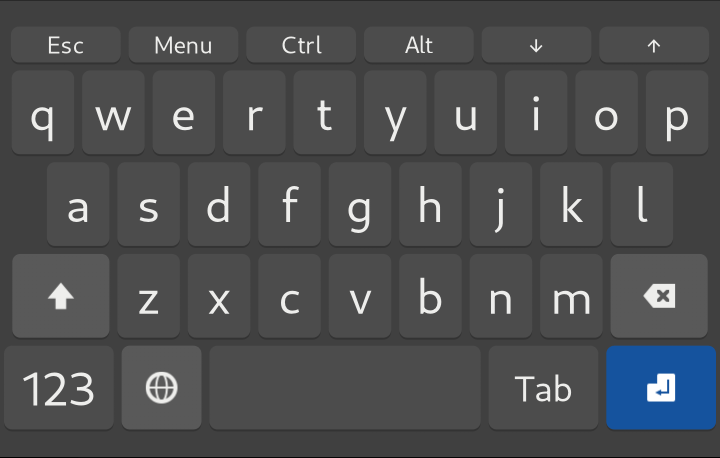
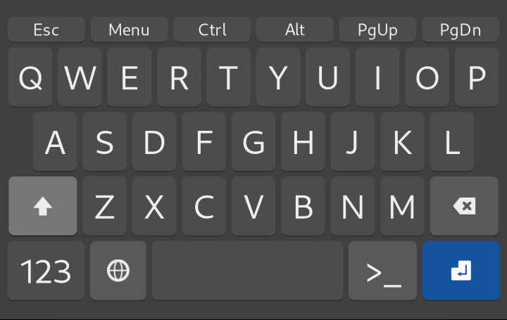
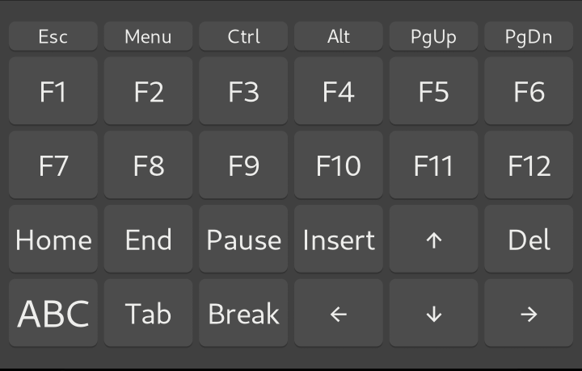
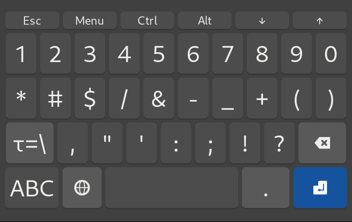
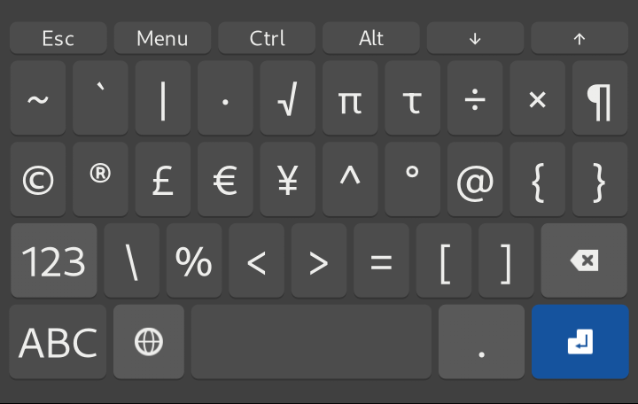

# squeekboard-neolayout

An improved keyboard layout for Pinephones with Phosh.

# Installation

Copy **us.yaml** to **~/.local/share/sqeekboard/keyboards/terminal**.
Create if doesn't exist.

# Screenshots

